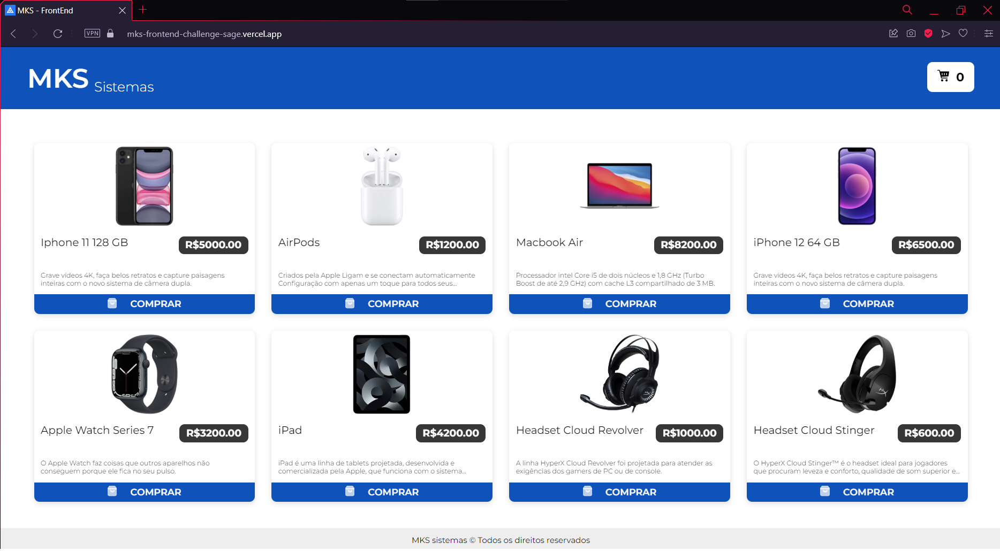
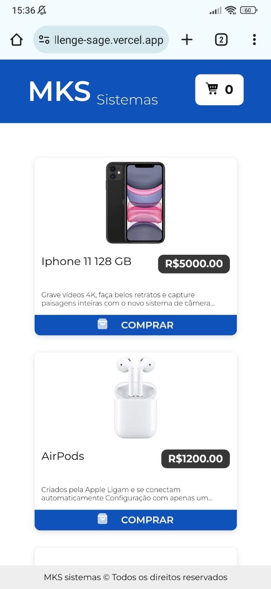

# mks-frontend-challenge

Este é o repositório do projeto "mks-frontend-challenge". O objetivo principal desse teste é avaliar a capacidade de escrever código limpo, bem testado e reutilizável.

### Versão Web e Mobile

<ul style="list-style: none; display: flex; justify-content: space-between; gap: 20px">
  <li>
    
  </li>
  <li>
    
  </li>
</ul>

## Ferramentas requeridas

- Typescript
- React ou Next.js
- React-Query
- Jest
- Styled-components

## Aspectos técnicos utilizados

- 

- 

- 

- 

- 

## Aspectos técnicos adicionais

- 
- 
- Componente de Toast
- Componente de IconeSVG totalmente editável (biblioteca react-svg + criação do componente)

## Design

O design do projeto foi criado no Figma e você pode conferir a versão final [aqui](https://www.figma.com/file/Z4z8osDbK1ET7cjNzFRMrK/MKS-Front-end-challenge?type=design&node-id=0-1&mode=design&t=8AzkSlXNNqNmXSse-0).

## API do Desafio

O projeto consome dados de uma API específica do desafio. Você pode encontrar a documentação da API em [link-da-api](https://mks-frontend-challenge-04811e8151e6.herokuapp.com/api-docs/).

## Como Rodar o Projeto

Você pode executar o projeto de duas maneiras:

**Opção 1:** A maneira mais fácil é acessar diretamente o site do projeto no seguinte link: [Projeto no Vercel](https://mks-frontend-challenge-sage.vercel.app)

**Opção 2:** Se preferir executar o projeto localmente, siga as etapas abaixo:

1. Clone este repositório:
   ```bash
   git clone https://github.com/LinsThi/mks-frontend-challenge.git
   ```
2. Navegue até o diretório do projeto
   ```bash
   cd mks-frontend-challenge
   ```
3. Instale as dependências:
   ```bash
   npm install ou yarn
   ```
4. Agora o aplicativo estará rodando em http://localhost:5173
